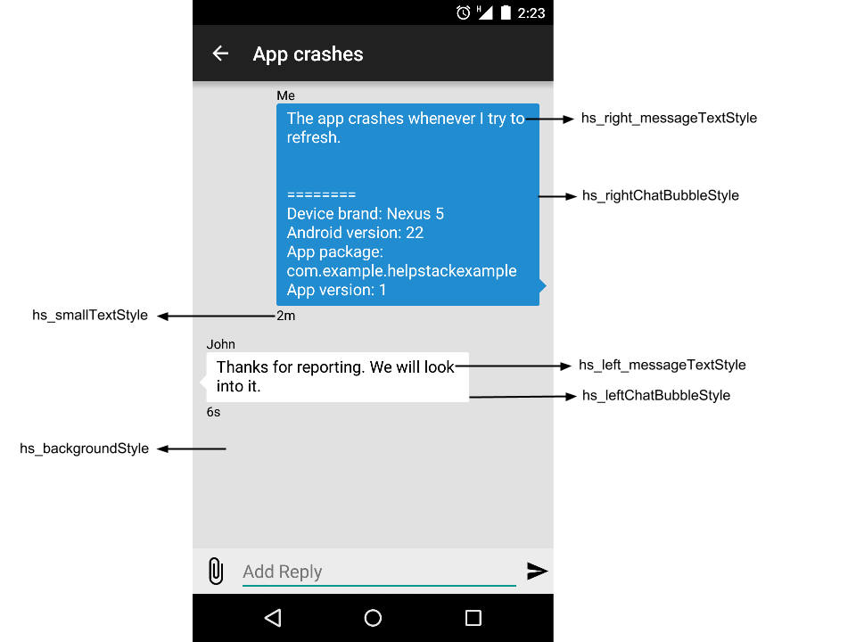

  

**HelpStack** is a library to provide in-app support for your app's users, by connecting with the helpdesk of your choice. Your app’s users can easily raise requests or report issues from within your app.

With HelpStack, you can:

- Let users report issues within your app
- Let users attach screenshots to their support requests
- Receive Device and App Information automatically, along with the reported issue
- Let users view your responses to their issues
- Provide self-support by showing FAQ articles
- Customise your HelpStack screen to blend with your app theme

HelpStack supports the following leading helpdesk solutions: 
- [HappyFox](https://www.happyfox.com/)
- [Zendesk](https://www.zendesk.com/)
- [Desk.com](http://www.desk.com/)

- Email - If you don't have a helpdesk solution, you can still configure HelpStack for users to raise requests via email.

You can choose any 1 of the 4 options mentioned above, to get started with HelpStack.

Check out [helpstack.io](http://www.helpstack.io) for more information.

  

## Installation

Installating the HelpStack library is fairly straight-forward.

### [Eclipse/ADT]:
1. Clone or download the library along with its dependencies from the Git repository. 
2. Import it as a library project into your Application. 
3. Set the flag for *manifestmerger.enabled* to *true* in your *project.properties* file:

        manifestmerger.enabled=true
        
    
- **[Error]: Jar mismatch! Found different versions of jar in the dependency list**: Replace the jar in the library with the jar from your project. Clean the project and build again.
 
### [Android Studio]:

1. Add jcenter as a repository to your app's build.gradle

        repositories {
          jcenter()
        }
        
2. Add *com.tenmiles:helpstack:1.0* as a dependency in the same build.gradle
        
        dependencies {
          compile 'com.tenmiles:helpstack:1.0'
        }

- **[Issue]: Duplicate files copied in APK**: This happens due to library version-mismatch. To avoid using the library from HelpStack, exclude it when you add the dependency. For example:

        compile ('com.tenmiles:helpstack:1.0') {
          exclude group: 'org.apache.httpcomponents', module: 'httpmime'
        }

## Using the Library

Broadly speaking, there are just 3 steps to begin using HelpStack within your app:

The helpdesk solutions will be referred to as **Gears**.

1. Configure HelpStack to work with the Gear of your choice.
2. Add an entry-point for HelpStack in the UI and connect it with HelpStack.
3. Customize the theme of HelpStack according to your choice.

#### Step 1 - Configure HelpStack with the Gear of your choice:

Create a custom *Application* class which extends the **Application** class. Be sure to mention it in your manifest as well.

    <application
      android:name="HSApplication"
      ...
    />    
    
Obtain the necessary credentials for the gear of your choice and create a suitable Gear object. Set the Gear object with *HSHelpStack* instance only once. 

##### i. HappyFox:

    public class HSApplication extends Application {
      
      HSHelpStack helpStack;
      
      @Override
      public void onCreate() {
        super.onCreate();
        
        // Get the HSHelpStack instance
        helpStack = HSHelpStack.getInstance(this);
        
        // Crate the Gear object 
        HSHappyfoxGear happyfoxGear = new HSHappyfoxGear(
                "<Account URL>",
                "<Your API Key>",
                "<Your Auth Code>",
                "<Category ID>",
                "<Priority ID>");
        
        // [Optional] Set the Section Id of your Knowledge Base articles
        happyfoxGear.setSectionId("<Section id>");
        
        // Set the Gear
        helpStack.setGear(happyfoxGear);
      }
      
    }

The API key and Auth code can be found in your HappyFox account under *Manage* > *Integrations*. You can generate an API key and Auth code by clicking on the API configure link.

Priority ID and Category ID cannot be nil. These are the ID's of the priority and the category with which tickets will be created. Setting the Section ID of your KB articles is optional. Navigate to the following URL's in your HappyFox account, to obtain the necessary details:

    https://<HappyFox account domain>/api/1.1/json/priorities/ 
    https://<HappyFox account domain>/api/1.1/json/categories/
    https://<HappyFox account domain>/api/1.1/json/kb/sections/

##### ii. Zendesk:
  
    public class HSApplication extends Application {
      
      HSHelpStack helpStack;
      
      @Override
      public void onCreate() {
        super.onCreate();
        
        // Get the HSHelpStack instance
        helpStack = HSHelpStack.getInstance(this);
        
        // Crate the Gear object 
        HSZendeskGear zendeskGear = new HSZendeskGear(
                "<Account URL>",
                "<Staff Email Address>",
                "<API Token");
                
        // [Optional] Set the Section Id of your Help Center articles
        zendeskGear.setSectionId("<Section id>");
        
        // Set the Gear
        helpStack.setGear(zendeskGear);
      }
      
    }
    
The token can be found in your Zendesk account under Settings > Channels > API. Setting the Section ID of your Help Center articles is optional. You can find the sections in your Zendesk account, as mentioned below:

    https://<Zendesk account domain>/api/v2/help_center/sections.json

##### iii. Desk:

    public class HSApplication extends Application {
     
      HSHelpStack helpStack;
      
      @Override
      public void onCreate() {
        super.onCreate();
        
        // Get the HSHelpStack instance
        helpStack = HSHelpStack.getInstance(this);
        
        // Crate the Gear object 
        HSDeskGear deskGear = new HSDeskGear(
                "<Account URL>",
                "<To Help email address>",
                "<Staff email address>",
                "<Staff password");
       
        // Set the Gear
        helpStack.setGear(deskGear);
      }
     
    }
   
##### iv. Email:
*Email address* and *Articles in xml format*

    HSEmailGear emailGear = new HSEmailGear( 
                "example@happyfox.com",
                R.xml.articles);
                

#### Step 2 - Entry point in UI:
Add a clickable item (probably a button) in your UI, wherever appropriate. Set a *click listener* to it. Within the *click listener*, use the **showHelp** API to open up the HelpStack UI:

    HSHelpStack.getInstance(getActivity()).showHelp(getActivity());

#### Step 3 - Theming/Skinning:

It is very easy to customize the HelpStack UI, if you want it go along with your app's UI.

HelpStack comes with built-in screens and a default theme. It also comes with a set of pre-configured themes. You can download them from the link below:

#### [Download Themes](./Themes/)

Each theme comes with the following:
- A *colors.xml* and a **hs_custom_theme.xml** defined in **../values/**
- Chat bubble drawables defined in **../drawables/**.

##### Using the sample themes
- Decide which sample theme you want to use
- Include the *theme* and *colors* xml files in your application under **values**
- Include the theme's drawables under your application's **drawables**
- Now you can simply build and run the application. The HelpStack UI will use the styles specified in the chosen theme.

Below is the list of parameters you can configure to change the looks of HelpStack:

**Main List View** 
 
 
**Issue Details View**
 

- **hs_backgroundStyle** - Background of all screens
- **hs_listViewStyle** - Articles and issues list
- **hs_listView_headerBackgroundStyle** - Header background of main list view
- **hs_listView_childBackgroundStyle** - Child view background of main list view
- **hs_listView_headerTextStyle** - ListView header text
- **hs_listView_childTextStyle** - ListView child text
- **hs_leftChatBubbleStyle** - Chat screen - left chat bubble style
- **hs_rightChatBubbleStyle** - Chat screen - right chat bubble style
- **hs_left_messageTextStyle** - Chat screen message text style for left chat bubble
- **hs_right_messageTextStyle** - Chat screen message text style for right chat bubble
- **hs_smallTextStyle** - Chat screen more info text style - applied to the sender name and time
- **hs_buttonStyle** - Button Style - applied for report issue button 
- **hs_editTextStyle** - Edit text Style in new user and new issue screen
- **hs_messageEditTextStyle** - Edit text Style used in chat screen - add reply

Override the styles specified in **/values/hs_custom_theme.xml** 

##### Icons and Images

  All the icons used in the HelpStack UI are defined under **Drawables** in the **hs_custom_theme.xml** file. In order to include your own icons, download and add the icons in your applications resources, and override the drawables specified in the theme for the UI to take up your own icons.
  
  Below are the icons used in HelpStack UI  :-

  - **hs_attachment_icon** - Attachment icon used in issue detail screen and New Issue screen
  - **hs_search_icon** - Search icon used in the action bar
  - **hs_disclosure_next** - Disclosure icon used in the main list view child item
  - **hs_add_attachment** - Add attachment icon used in issue detail screen, to add an attachment

##### Note

  If you want the complete look-and-feel of a theme, you might also want to update the color of your app's Action bar.

## External Dependencies

HelpStack depends on the following libraries:

    com.android.support:appcompat-v7:20.0.0
    com.google.code.gson:gson:2.2.4
    org.apache.httpcomponents:httpmime:4.2.6
    com.mcxiaoke.volley:library-aar:1.+
  
## About
For more information about HelpStack, visit [helpstack.io](http://www.helpstack.io).

HelpStack is maintained by the folks at [HappyFox](http://www.happyfox.com/). Being an open source project, it also contains work from the HelpStack community.

  

## Contact

Reach out to us on Twitter at [@HelpStack](https://twitter.com/HelpStackSDK).

## License

HelpStack is available under the MIT license. See the LICENSE file for more info.
