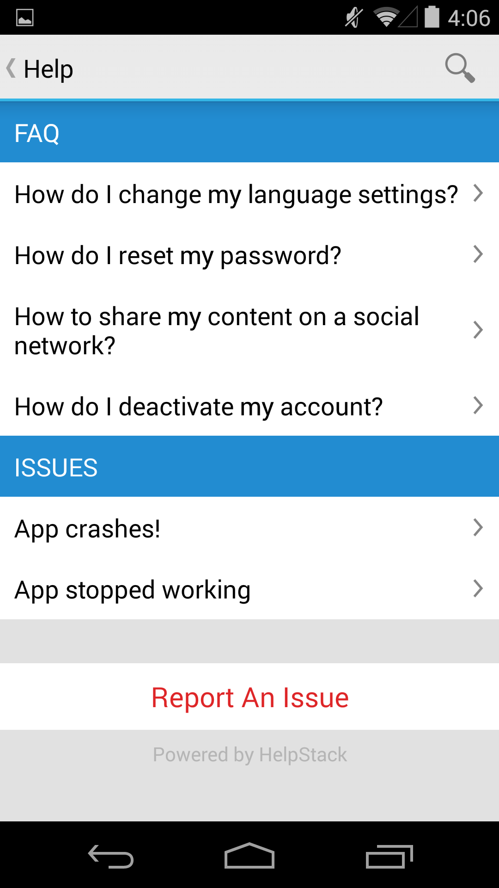

### Theme Details

- Name: HSLightTheme
- Creator: Tenmiles

This theme comes with the following files:
- drawables
  - hs_light_leftchatbubble.xml
  - hs_light_rightchatbubble.xml
- values
  - hs_custom_theme.xml
  - hs_light_colors.xml
- screenshot
  - HSLightTheme.png

### Screenshots

### Customizing the Action Bar

Ensure your *AppTheme* style found in **res/values/styles.xml** uses **Theme.AppCompat.Light** as its parent.

### Note
To know more on how to use this theme file, refer to the Theming/Skinning section of the main README document located at the root of the project.
