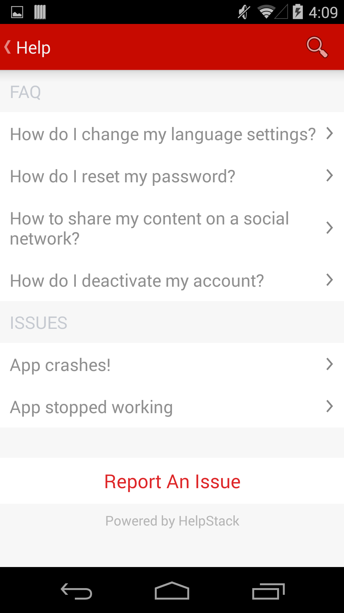

### Theme Details

- Name: HSPinterestTheme
- Creator: Tenmiles

This theme comes with the following files:
- drawables
  - hs_pinterest_leftchatbubble.xml
  - hs_pinterest_rightchatbubble.xml
- values
  - hs_custom_theme.xml
  - hs_pinterest_colors.xml

### Screenshots


### Customizing the Action Bar

You should make the following changes to get the Action Bar colors match the theme. 

In your **res/values/styles.xml** copy the below contents:

```
<resources>

    <!--
        Base application theme, dependent on API level. This theme is replaced
        by AppBaseTheme from res/values-vXX/styles.xml on newer devices.
    -->
    <style name="AppBaseTheme" parent="Theme.AppCompat.Light.DarkActionBar">
        <!--
            Theme customizations available in newer API levels can go in
            res/values-vXX/styles.xml, while customizations related to
            backward-compatibility can go here.
        -->
        <item name="actionBarStyle">@style/MyActionBar</item>
    </style>

    <style name="MyActionBar" parent="@style/Widget.AppCompat.Light.ActionBar.Solid.Inverse">
        <item name="android:background">@color/hs_pinterest_primaryColor</item>
    </style>

</resources>
```


In your **res/values-v11/styles.xml** copy the below contents:

```
<resources>

    <!--
        Base application theme for API 11+. This theme completely replaces
        AppBaseTheme from res/values/styles.xml on API 11+ devices.
    -->
    <style name="AppBaseTheme" parent="Theme.AppCompat.Light.DarkActionBar">
        <!-- API 11 theme customizations can go here. -->
        <item name="android:actionBarStyle">@style/MyActionBar</item>
    </style>

    <style name="MyActionBar" parent="@style/Widget.AppCompat.Light.ActionBar.Solid.Inverse">
        <item name="android:background">@color/hs_pinterest_primaryColor</item>
    </style>

</resources>
```

### Note
To know more on how to use this theme file, refer to the Theming/Skinning section of the main README document located at the root of the project.
